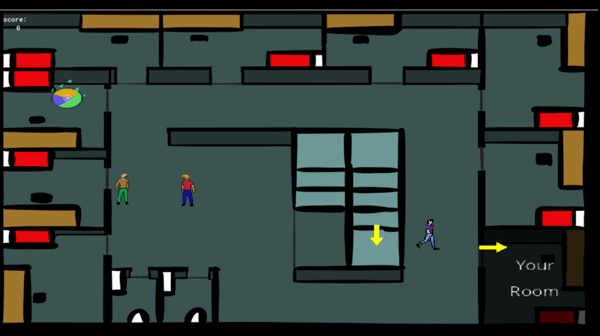

# FreddieGoesToTheBank

Small game project using GameMaker Studio 2.

 !!you might have to download some GameMaker utility to run it!! - which is evil, but what can you do

If you do not want to download GameMaker's bloatware, feel free to take a look at the GIFs below:

